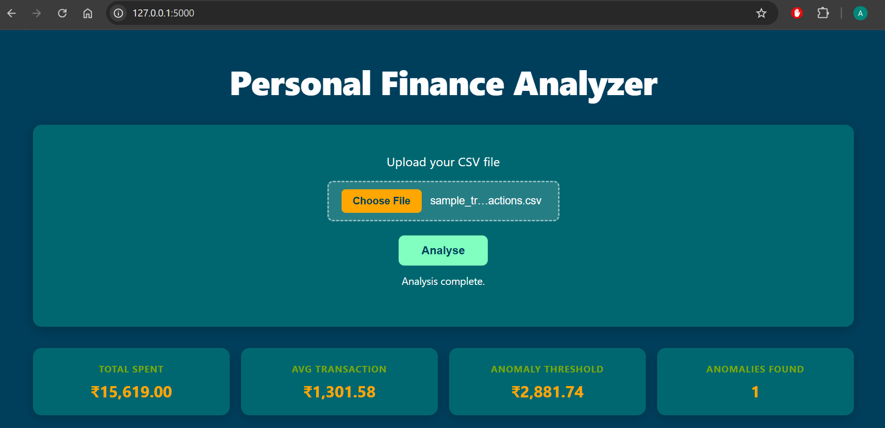
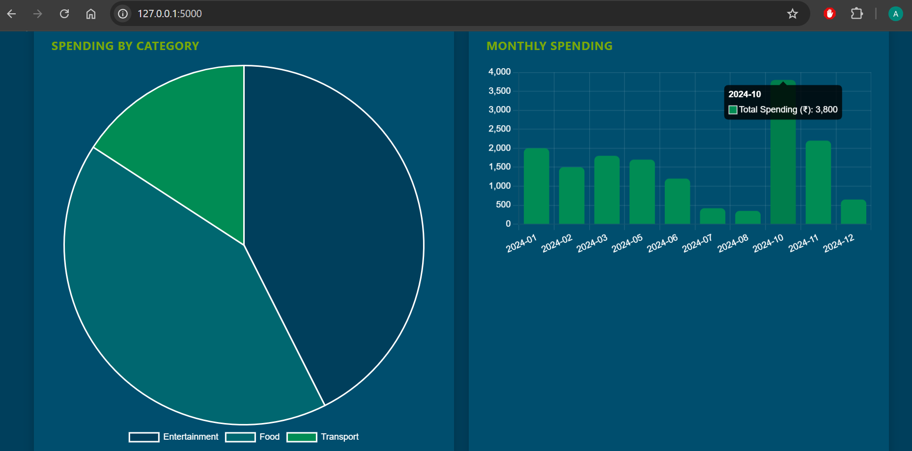
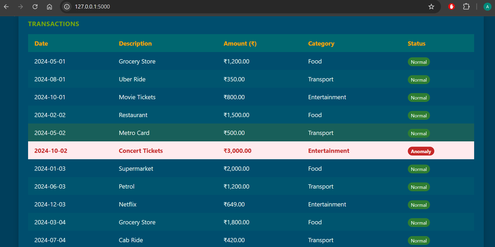

# Finance Analyzer

A Flask-based web application for analyzing financial transactions and visualizing insights.

## Features
- Upload transaction data
- Analyze spending patterns
- Interactive dashboard

## Tech Stack
- Python
- Flask
- Pandas
- Matplotlib

## Screenshots

### Upload Page

### Dashboard

### Anomaly Detection
